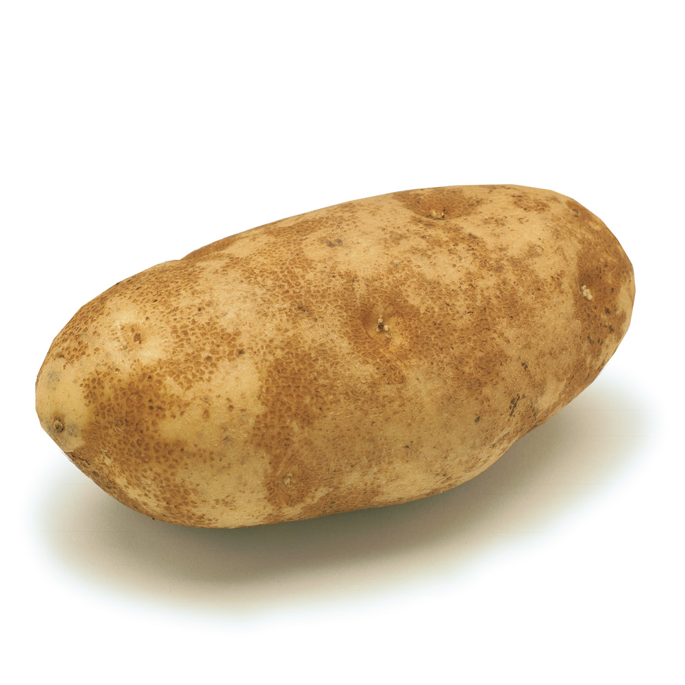
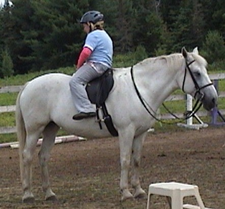
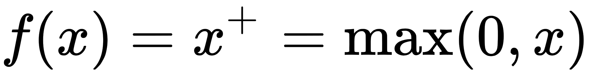
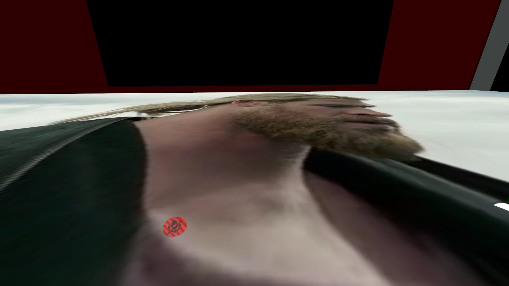

# ConvolutionalNeuralNetwork
## A Convolutional Neural Network written in C#, Except, wait for it... Here is the big reveal... IT IS MADE BY ME THIS TIME.

The following is an image of a russet potato.

# But who is this Neural Network guy everyone is talking about?
Neural Networks are sort of the cars of neural networks, given that, just like cars, they are indeed an endangered species.
So you might be thinking, how can I get my hands on a neural network? Well take it from me, you can't just take an online course
and act like you own the thing... You gotta build one. Now at the time of writing this, I have made a wopping 100% more neural networks than I had when I was not yet born, impressive right. Well lets start with the big bois. propagation and backpropagation.

# Propagation
propagation is sort of the Bill Cosby of the Neural Network world because just like the Bill, it will hunt you down and change you forever. Propagation in this instance works by iterating through a set of data, data in a set... A DATASET gotcha, and changing each value based on a set of weights and biases... Sort of like how the American voting system works. and for backpropagation, just think propagation but drunk.
# Sigmoid more like gradient descent amirite

So you might be thinking, rhetorical question? right, well don't worry I was also concered about how I was going to achieve a functioning neural network system without the of sigmoid due to the fact that sigmoid consistantly causes gradient descent, which can lead to innacurate and sometimes completely false results after training a neural network on large datasets... Well ya bois gotcha covered, sigmoid just like cancer, is old news, nobody realy wants to hear how you can graph an S you dumb bescumbered MICROPHALLUS! Now you cure cancer and user ReLU.

# Sigmoid
While Sigmoid can easily be represented as an 's' on a graph... or it would be better to actualy use Sigmoid and not the letter s:

# ReLU (the right one).
ReLU is like a giant pyramid that fell over... or this:

# But who is this ReLU guy everyone is talking about?
BUT WHAT DOES THAT MEAN you might be yelling into your $87 monitor you cheap goon.
well my dear friend, it is quite simple, imagine a dog. Now this is a fairly big dog, I mean like Clifford sized. Now you are the old woman from 101 dalmatians and want to make him the size of just 1 dog. or due to the fact that ReLU it simply superiour to Sigmoid, any sized dog you want!

# But why user ReLU or Sigmoid, Can't I just use the dirty, unsanitized data as I get it?... No
So why use ReLU?
Stop asking questions and let me finish. ReLU is used by the big bois to make sure that your dog does not get too fat and make your neural network go haywire. The reason that we use one of these two functions (or just ReLU if you are a normal human being) for activating neurons is because it makes it possible for the neural networks "models" to adapt consistantly with a variety of data.
# Here is a question Why are you still here?
Now you might be thinking... HOLD ON JUST A SECOND, you had me at russet potato but about skynet. Well fear not real person, google has ya covered. Billary Clinton, CEO of Google's deep-brain division has established a Committee of Unified NeuralNetwork treasurers, I am pretty sure that there is an acronym for that but I forgot what it was. Anyway those guys have a sole purpose of creating a giant A.I death machine to wipe out all Robots in the event of an A.I invasion. Now you might be wondering, but what if the robot turns on humans...

# But what color is my neural network going to be, and why is my capitalization so inconsistant?
The color format of neural network reminds me of a russet potato because it is completely irrelevent and has nothing to do with potatoes (except for the latter mentioned russet potato, due to the fact that it is indeed, a potato).

# About the Author

'I' or as the ladies like to call me "THE ALOC" was born in south Dakota but grew up in the harse wastes of Antartica, during my time there I was stripped of all technology and lived like an eskimo Amish man, During this time that I was deprived of technology I learnet how to do the programms in the most useful language of all time gml. in this...... P R O G R A M M I N G language I pretty much became the Stephan King of programming languages... Given that I spent 24 hours a day in a chair.
